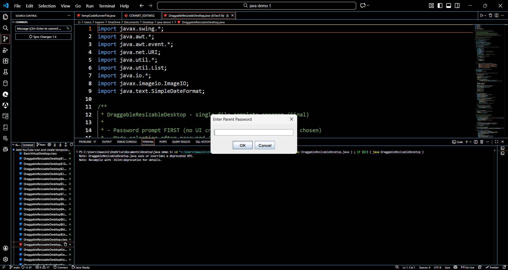
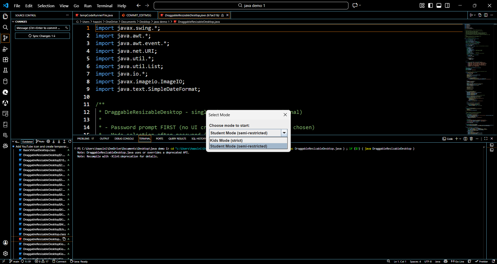

# Adaptable Java Desktop – Mini Desktop


[](LICENSE)


## 📌 Project Overview
**Adaptable Java Desktop** is a desktop application built in **Java** with **Swing** for UI, designed to provide a customizable virtual desktop environment. The application includes **parental controls, application restrictions, and usage tracking**, making it suitable for **schools, libraries, or home usage**. Users can operate in **Kids Mode** (strict restrictions) or **Student Mode** (semi-restricted), ensuring safe and productive computer usage.

---

## 🛠 Technologies Used
- **Java (Core Java, Swing, AWT)** – for desktop application logic and UI  
- **Git & GitHub** – version control and repository management  
- **PowerShell (Windows)** – hide/show taskbar dynamically  
- **ImageIO & File Handling** – for wallpapers and app icons  
- **Timers & Event Handling** – for usage tracking and automatic app restrictions  

---

## ✨ Key Features
- **Parental Control:** Set time limits, block/unblock apps, auto-reset work/break cycles  
- **Kids Mode:** Opens browser apps in app mode with no tabs/address bar  
- **Student Mode:** Normal browser with isolated profiles  
- **Virtual Desktop Icons:** Add, move, rename, and resize application shortcuts  
- **Recycle Bin:** Temporarily delete apps and restore them later  
- **Custom Wallpapers:** Set personalized desktop backgrounds  
- **Usage Tracking:** Track how long apps are used and enforce automatic limits  

---
## 📁 Project Structure
```text 
Adaptable-Java-Desktop--Mini-Desktop/
│
├── DraggableResizableDesktop.java   # Main application file
├── images/                          # Wallpapers and icons
├── README.md                        # Project documentation
├── LICENSE                          # MIT License
└── .gitignore                       # Ignored files
```

## 🚀 How to Run the Project
### Prerequisites
- Java JDK 17 or above
- Windows OS
- Basic knowledge of running Java programs

**Clone the repository:**
```bash
git clone https://github.com/BudagamHaasini/Adaptable-Java-Desktop--Mini-Desktop.git
```
**Compile the code:**
```bash
javac DraggableResizableDesktop.java
```
**Run the program:**
```bash
java DraggableResizableDesktop
```
---

## 📸 **Screenshots**
### Enter Password


### Select Mode


### Main Desktop


---

## 🏫Real-World Applications
- **Schools:** Restricted desktops for children in computer labs  
- **Libraries:** Safe public systems with controlled access  
- **Homes:** Parental supervision and screen-time management  

----

## 🔮 Future Enhancements
- **Role-Based Access Control:** Create separate profiles for parents, students, and children with customizable permissions.
- **Advanced Usage Analytics:** Visual dashboards showing app usage trends, screen time statistics, and productivity reports.
- **Database Integration:** Store user preferences, restrictions, and activity logs using MySQL or SQLite.
- **Cross-Platform Support:** Extend compatibility to Linux and macOS using JavaFX.
- **Packaging & Distribution:** Convert the application into a runnable `.jar` or Windows `.exe` installer.
- **Cloud Sync:** Enable cloud-based backup of user settings and activity data for multi-device access.
- **AI-Based Smart Restrictions:** Automatically adjust app limits based on usage behavior and time of day.
- **Secure Authentication:** Add encrypted password storage and session management.
----

## 🏆 Achievements
- Project selected for **College-Level Project Expo at SRU**

----

## License
This project is licensed under the [MIT License](LICENSE).


